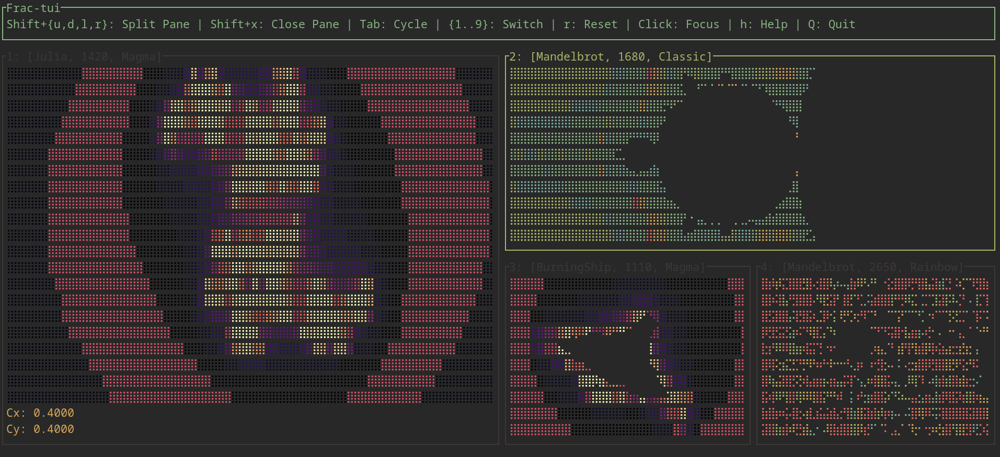
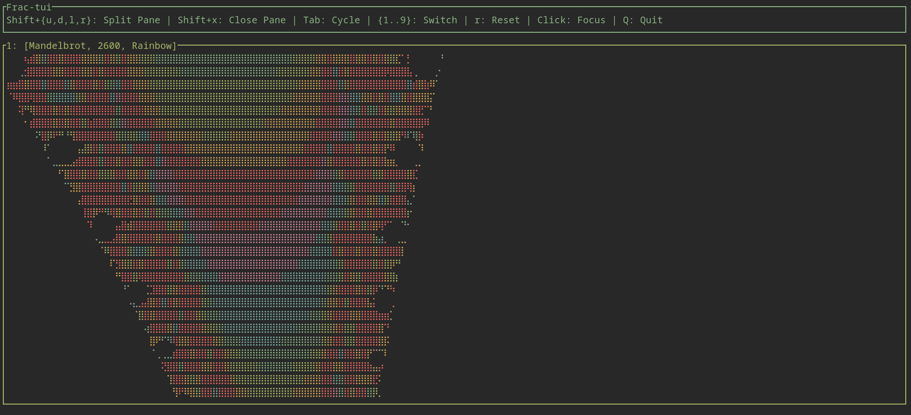

# **Ratatui Fractal Renderer**

A high-performance, multithreaded TUI (Terminal User Interface) fractal explorer written in Rust using [Ratatui](https://ratatui.rs/). It functions as a tiling window manager for fractal simulations, allowing you to run multiple independent renders of the Mandelbrot and Burning Ship sets simultaneously.



 
## **Features**

* **Tiling Window Manager**: Split the screen horizontally or vertically (inspired by tillix) to view multiple fractals at once.
* **ascii art-like**: Uses Braille markers (2×4 dots per character) for rendering.
* **gpu-enabled**: Uses rayon to achieve fast performance.
* **Independent Simulations**: Each pane has its own state (zoom, position, palette, fractal type, iteration limit).
* **Interactive controls**: Smooth panning and zooming (keyboard \+ mouse) with mouse focus support.
* **Dynamic resolution**: Adjusts calculation density automatically when the terminal or pane resizes.
* **Aspect ratio correction**: Maintains a 1:1 mathematical aspect ratio regardless of pane shape.
* **Multiple fractals**: Toggle between Mandelbrot,Burning Ship, and julia fractals.
* **Color palettes**: Classic, Rainbow, and Magma themes.

## **Installation**


if you have rust installed, simply clone the repository:
```bash
git clone https://github.com/dotacow/frac-tui-rs
cd frac-tui-rs
```

run as any standard rust project:
```bash
cargo run --release
```

there is also a docker setup for easy usage without rust installed. see the Makefile and docker/docker-compose.yaml for details. basic usage:
```bash
make run
```

if you didn't add your user to the docker group, you will need to run with sudo:
```bash
sudo make run
```

## **Controls**

* **h**: shortcut glossary
### **Window Management**
* **Shift \+ {l,r,u,d}**: Split active pane left/right/up/down
* **Shift \+ X**: Close active pane
* **Tab**: Cycle focus between panes
* **1-9**: Instantly switch focus to pane \#1–9
* **Mouse Click**: Focus specific pane

### **Fractal Navigation (Active Pane)**
* **Arrow keys**: Pan the view
* **Mouse wheel**: Zoom in/out relative to cursor
* **\+ / \-**: Zoom in/out (center-focused)
* **r**: Reset view to default

### **Simulation Settings**

* **Space**: Cycle color palettes (Classic, Rainbow, Magma)
* **b**: Switch fractal mode (Mandelbrot - Burning Ship, Julia)
* **d**: Increase max iterations (more detail)
* **s**: Decrease max iterations (faster rendering)

### **Application**

* **q / Esc**: Open Quit Confirmation
* **y / n**: Confirm or Cancel Quit

## **Technical Details**

### **Architecture**

The application uses a **recursive tree structure** (PaneNode) to manage layout. Panes can be leaves (rendering a fractal) or splits (containing children). This allows for infinite nesting of vertical and horizontal splits, similar to multiplexers like Tmux or i3.

### **Rendering strategy**

The app uses the Ratatui Canvas widget and renders using Braille characters. To avoid stretched images, the renderer calculates the required density based on the specific Rect area of the active pane:

* Width density: pane\_width \* 2
* Height density: pane\_height \* 4

### **Parallelization**

rayon is used to parallelize the pixel calculation. Each worker computes a subset of the coordinate grid into thread-local buffers using a map-reduce pattern. These buffers are merged into a final batch for drawing, ensuring the UI remains responsive even at high iteration depths.

## **License**

This project is licensed under the MIT license. See LICENSE for details.

## **Links & Credits**

* Ratatui: https://ratatui.rs
* Simple template used as a starting point: https://github.com/ratatui/templates/tree/main/simple
